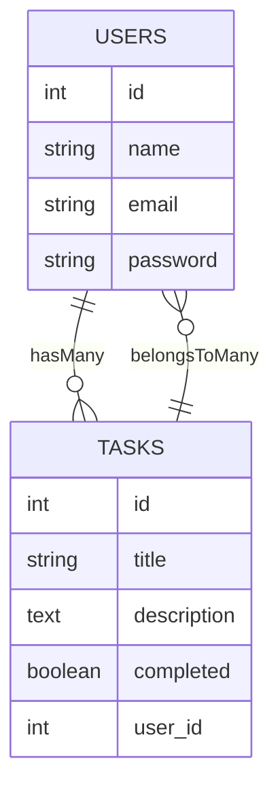
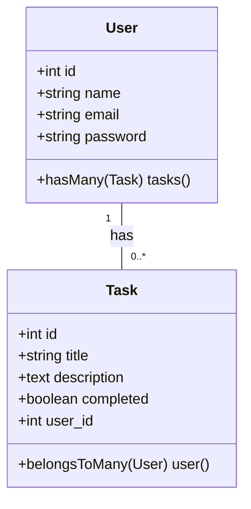
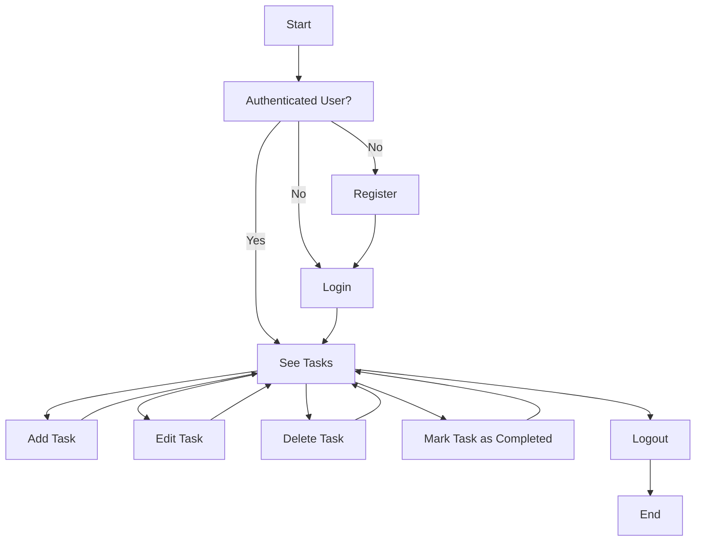

# Proyecto final kodigo

## Aplicación de gestión de tareas
Aplicación fullstack de gestión de tareas con React en el frontend y Laravel en el backend.

### Documentación de la API
Probamos todos los endpoints, primeramente los de autenticación y luego los de tareas, resultando exitosos.
La documentación de la API se encuentra [publicada en Postman](https://documenter.getpostman.com/view/21524567/2sA3kYiKR5)

### Diseño de la aplicación

#### Modelo de la base de datos
Diseñamos la base de datos en MySQL, de acuerdo al Modelo Entidad-Relación que plasma la estructura de la base de datos, con dos tablas principales: `users` y `tasks`. La tabla `users` contiene los datos de los usuarios, y la tabla `tasks` contiene los datos de las tareas, con una relación de uno a muchos con la tabla `users`.



#### Diagrama de clases
El diagrama de clases es bastante sencillo, con dos clases principales: `User` y `Tarea`. La clase `User` tiene una relación de uno a muchos con la clase `Tarea`, ya que un usuario puede tener muchas tareas, y una tarea pertenece a uno o varios usuarios.




#### Diagrama de flujo de datos
El diagrama de flujo facilita la comprensión de cómo interactúan los diferentes elementos de la aplicación con la información. En este caso, se muestra el flujo de autenticación de un usuario y todas las acciones que se pueden, hasta el momento de finalizar la sesión.




Ejecutar el Proyecto
Inicia el servidor de desarrollo con:
npm run dev
```
Esto debería abrir la aplicación React en tu navegador en http://localhost:5173.


Configuración del Proyecto Laravel con Sanctum
Crear el Proyecto Laravel
Para crear un nuevo proyecto Laravel, ejecuta el siguiente comando:

```bash
composer create-project --prefer-dist laravel/laravel nombre_proyecto
nombre_proyecto: Este es el nombre del proyecto Laravel.
Accede al directorio del proyecto:
cd nombre_proyecto
```

Configura el archivo .env
Abre el archivo .env en la raíz del proyecto y configura la conexión a la base de datos. Asegúrate de que la base de datos esté creada y que los detalles sean correctos.
DB_CONNECTION=mysql
DB_HOST=127.0.0.1
DB_PORT=3306
DB_DATABASE=nombre_base_datos
DB_USERNAME=usuario
DB_PASSWORD=contraseña

Instalar Laravel Sanctum
Ejecuta el siguiente comando para instalar Laravel Sanctum:
```bash
composer require laravel/sanctum
Publica la configuración de Sanctum:
php artisan vendor:publish --provider="Laravel\\Sanctum\\SanctumServiceProvider"
Ejecuta las migraciones para crear las tablas necesarias en la base de datos:
php artisan migrate
```
